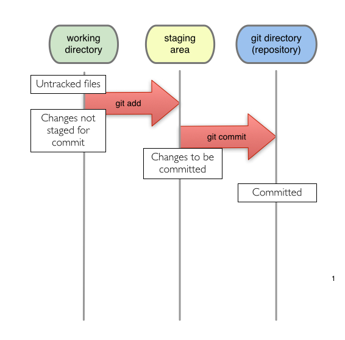

# 三種狀態
* 工作目錄內的每個檔案可能為兩種狀態的任一種：追蹤或者尚未被追蹤
* 被追蹤的檔案是最近的快照；它們可被復原、修改，或者暫存
* 未被追蹤的檔案則是其它未在最近快照也未被暫存的任何檔案


* Untracked files: 尚未被add過的檔案
* Changes not staged for commit: commit過後的修改，但尚未被add的檔案
* Changes to be committed: 已經add過，但尚未被commit的檔案



# 初始化
```
D:\Temp>git init test1 & cd test1
Initialized empty Git repository in D:/Temp/test1/.git/
```

# 新增檔案
```
D:\Temp\test1>echo a > a.txt & git status
On branch master

Initial commit

Untracked files:
  (use "git add <file>..." to include in what will be committed)

        a.txt

nothing added to commit but untracked files present (use "git add" to track)
```

# 加入
```
D:\Temp\test1>git add . & git status
On branch master

Initial commit

Changes to be committed:
  (use "git rm --cached <file>..." to unstage)

        new file:   a.txt
```

# 送交 
```
D:\Temp\test1>git commit -m "add a.txt" & git log
[master (root-commit) cd65db7] add a.txt
 1 file changed, 1 insertion(+)
 create mode 100644 a.txt
commit cd65db760226f7a11889344c638679db423c2005
Author: 李明憲 <xian@xsg.com.tw>
Date:   Tue Nov 29 16:37:31 2016 +0800

    add a.txt
```

# 修改
```
D:\Temp\test1>echo aa > a.txt & git status
On branch master
Changes not staged for commit:
  (use "git add <file>..." to update what will be committed)
  (use "git checkout -- <file>..." to discard changes in working directory)

        modified:   a.txt

no changes added to commit (use "git add" and/or "git commit -a")
```

# 加入
```
D:\Temp\test1>git add . & git status
On branch master
Changes to be committed:
  (use "git reset HEAD <file>..." to unstage)

        modified:   a.txt
```

# 送交
```
D:\Temp\test1>git commit -m "edit a.txt" & git log
[master 4f644b0] edit a.txt
 1 file changed, 1 insertion(+), 1 deletion(-)
commit 4f644b07dca48c718fb07797aa03c05cd7066f69
Author: 李明憲 <xian@xsg.com.tw>
Date:   Tue Nov 29 16:38:29 2016 +0800

    edit a.txt

commit cd65db760226f7a11889344c638679db423c2005
Author: 李明憲 <xian@xsg.com.tw>
Date:   Tue Nov 29 16:37:31 2016 +0800

    add a.txt
```