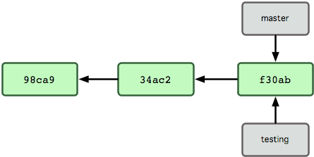

# 資料結構

# 每個commit物件包含一個tree物件和上一個commit

# 每個tree包含當次版本的所有檔案快照

# 分支名稱只是一個指向到commit的連結

# 新建分支只是在refs/heads內新增一個對應的檔案(41byte)

# HEAD指向到目前分支的最新版本

# 切換分支時只是切換HEAD對應的索引

# 分支commit一個版本，HEAD也會跟著移動一個版本

# 切換回master分支，HEAD也更新回master的最新值

# master commit一個版本，HEAD也跟者移動一個版本
