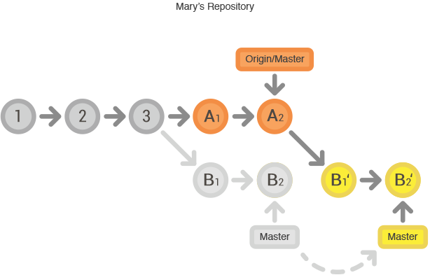
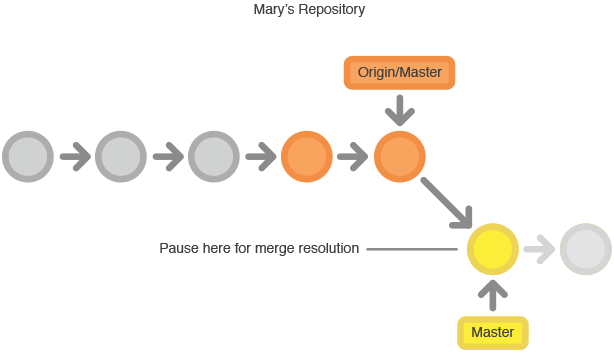

# 集中式工作流
* 初始化遠端倉庫並且只使用master分支
* 每個人都clone遠端倉庫回本地開發
* 推送同步之前先再次拉取遠端倉庫確認是否有其他人後續交付的版本
* 在本地端解決衝突後才推送新版本到遠端倉庫
* **已經推送到遠端倉庫的記錄嚴禁修改**
* 優點是簡單直接
* 缺點是只有master一個分支版本只能線性發展

# 初始化遠端倉庫並且只使用master分支

# 每個人都clone遠端倉庫回本地開發

# A推送功能1

# B推送功能2失敗

# B取出A推送的功能1

# B合併A推送的功能1
* master的版本: 1->2->3
* A本地送交了版本: 1->2->3->A1->A2
* B本地送交了版本: 1->2->3->B1->B2
* A先推送到master的版本: 1->2->3->A1->A2
* B要推送到master的版本: 1->2->3->B1->B2失敗
* B要rebase成版本1->2->3->A1->A2->B1'->B2'

# B解決衝突後推送功能2

# 參考連結
* [Centralized Workflow](https://www.atlassian.com/git/tutorials/comparing-workflows/centralized-workflow)
* [Git工作流指南：集中式工作流](http://blog.jobbole.com/76847/)
