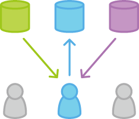

# Forking工作流
* 遠端倉庫有公開的和私人的兩個
* 每個人Fork公開的倉庫成私人的倉庫
* 開發都在私人的倉庫中進行
* 完成後發起Pull Request到公開的倉庫
* 公開倉庫的管理者決定是否合併版本
* 優點是不用給所有人公開倉庫的寫入權限

# 初始化專案倉庫

# Fork專案倉庫

# 各自取回各自fork後的倉庫

# 各自開發功能項目

# 推送各自開發的項目

# 發出Pull Request給專案倉庫

# 同步專案倉庫

# 相關連結
* [forking-workflow](https://www.atlassian.com/git/tutorials/comparing-workflows/forking-workflow)
* [Git工作流指南：Forking工作流](http://blog.jobbole.com/76861/)