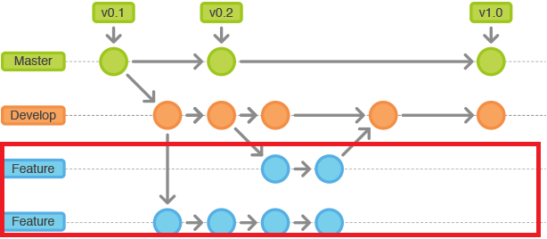
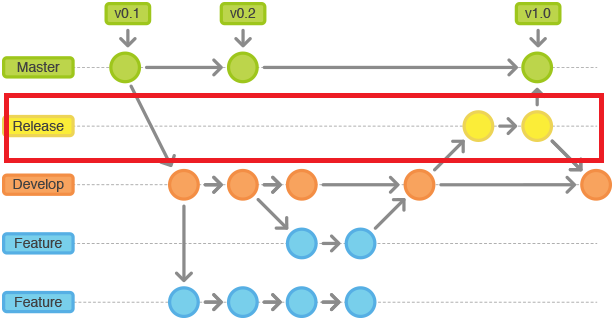
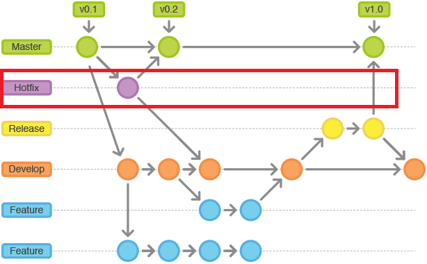

# Gitflow工作流

* 使用master和develop兩個分支來記錄專案歷史
* master分支為發行版合併版本後加上版號tag
* develop分支為開發版用來做功能性分支基底
* 功能性分支開發完成後pull request回develop
* release用來修develop分支bug和合併回master
* hotfix用來修master分支bug
* 優點是每個角色分配給不同的分支，明確地定義什麼情況該如何互動
* 缺點是太過復雜

# master與develop分支

# feature分支

# release分支

# hotfix分支

# 參考連結
* [gitflow-workflow](https://www.atlassian.com/git/tutorials/comparing-workflows/gitflow-workflow)
* [Git工作流指南：Gitflow工作流](http://blog.jobbole.com/76867/)
